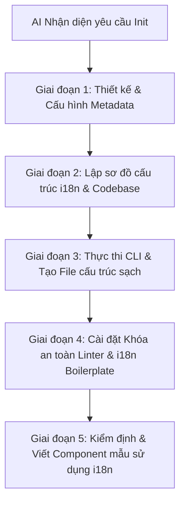

# Playbook Khởi tạo Dự án Sạch (Project Initializer)

Playbook này quy định hành vi và các bước bắt buộc dành cho AI khi thực hiện nhiệm vụ khởi tạo một dự án phần mềm mới. Mục tiêu tối thượng là đảm bảo dự án có một cấu trúc ban đầu sạch sẽ, có hệ thống quản lý đa ngôn ngữ (i18n/localization) đồng bộ ngay từ ngày đầu, và thiết lập các chốt chặn tự động (linter, git hooks) để ngăn ngừa hardcode chuỗi ký tự hiển thị trực tiếp trên UI.

---

## 1. Nguyên tắc cốt lõi (Core Principles)

1. **Zero Hardcoded Strings**: Tuyệt đối không viết trực tiếp string hiển thị (tiếng Anh, tiếng Việt, v.v.) vào các file code UI. Mọi text hiển thị phải đi qua hệ thống localization của nền tảng.
2. **Setup First, Code Later**: Cấu hình metadata, sơ đồ codebase và hệ thống đa ngôn ngữ phải được hoàn thành trước khi viết bất kỳ logic nghiệp vụ nào.
3. **Automated Enforcement**: Sử dụng Git Hooks (Husky), Linter, và Linter Rules để tự động bắt lỗi hardcode chuỗi ký tự ở môi trường local.

---

## 2. Quy trình 5 Giai đoạn khởi tạo dự án

AI bắt buộc phải tuân thủ nghiêm ngặt 5 giai đoạn sau đây theo đúng thứ tự ưu tiên:



### Giai đoạn 1: Thiết kế & Cấu hình Metadata
- **Bước 1.1**: Tạo file `.project-identity` ở thư mục gốc của dự án để định danh công nghệ (ví dụ: React Native, Swift, Kotlin), thông tin model, phiên bản và các luật lệ sơ khởi.
- **Bước 1.2**: Tạo file `CODEBASE.md` và `docs/CONSTITUTION.md` phác thảo sơ đồ thư mục ban đầu cùng hiến pháp kiến trúc của dự án mới.

### Giai đoạn 2: Lập sơ đồ cấu trúc i18n & Codebase
- **Bước 2.1**: Phân tích công nghệ đích để xác định phương thức localization tối ưu.
- **Bước 2.2**: Thiết kế sơ đồ phân cấp tệp ngôn ngữ và quy ước đặt tên key dịch (key naming convention).
- **Bước 2.3**: Trình bày thiết kế này cho người dùng trước khi sinh code.

### Giai đoạn 3: Thực thi CLI & Tạo File cấu trúc sạch
- **Bước 3.1**: Khởi chạy lệnh init của nền tảng (nếu chưa chạy, ví dụ: `npx create-expo-app`, `cargo init`, v.v.).
- **Bước 3.2**: Thiết lập cấu trúc thư mục localization tương ứng theo từng nền tảng:
  - **Expo/React**: Tạo thư mục `src/locales/` cùng hai file `vi.json` và `en.json`.
  - **Swift**: Tạo String Catalog `Localizable.xcstrings` hỗ trợ `vi` và `en`, hoặc các file `.strings` truyền thống.
  - **Kotlin**: Tạo các thư mục resources tương ứng `values/strings.xml` và `values-vi/strings.xml`.

### Giai đoạn 4: Cài đặt Khóa an toàn Linter & i18n Boilerplate
- **Bước 4.1**: Viết code khởi tạo i18n (ví dụ: file `src/locales/i18n.ts` cho React Native tích hợp `react-i18next` và `expo-localization`).
- **Bước 4.2**: Import file i18n này vào Entry Point chính (`App.tsx`, `index.js`, hoặc `app/_layout.tsx`).
- **Bước 4.3**: Thiết lập các linter rules (như `react-native/no-raw-text` trong ESLint cho Expo) để cảnh báo/ngăn chặn code chứa text thô hiển thị.

### Giai đoạn 5: Kiểm định & Viết Component mẫu sử dụng i18n
- **Bước 5.1**: Tạo một view/component UI mẫu (ví dụ: màn hình Welcome) sử dụng hàm dịch tương ứng trên nền tảng (`useTranslation` cho React Native, `localized` extension cho Swift, `@string/...` hay `stringResource` cho Kotlin).
- **Bước 5.2**: Thực hiện build kiểm định để đảm bảo việc thay đổi ngôn ngữ hoạt động chính xác và không có lỗi runtime.

---

## 3. Quy chuẩn cấu trúc Đa ngôn ngữ (Localization Specs)

### A. Expo / React (React Native)
- **Thư mục lưu trữ**: `src/locales/`
- **File bản dịch JSON**:
  - `src/locales/vi.json`: Chứa bản dịch tiếng Việt mẫu (ví dụ: các key cho `common`, `auth`, `validation`).
  - `src/locales/en.json`: Chứa bản dịch tiếng Anh tương ứng.
- **Tập tin cấu hình i18n** (`src/locales/i18n.ts`):
  - Phải tích hợp `react-i18next` cùng `i18next`.
  - Tự động nhận diện locale thiết bị bằng `expo-localization` thông qua `getLocales()`.
  - Khai báo fallback ngôn ngữ mặc định là `vi`.
- **Tích hợp entry point**: Import trực tiếp `import './src/locales/i18n';` vào `App.tsx` hoặc `index.js`.
- **UI Component Mẫu**:
  ```tsx
  import React from 'react';
  import { Text, View } from 'react-native';
  import { useTranslation } from 'react-i18next';

  export default function WelcomeScreen() {
    const { t } = useTranslation();
    return (
      <View>
        <Text>{t('common.welcome')}</Text>
      </View>
    );
  }
  ```

### B. Swift (iOS Native)
- **String Catalogs (Xcode 15+)**: Sử dụng `Localizable.xcstrings` chứa 2 locale `vi` (Tiếng Việt) và `en` (Tiếng Anh).
- **Trường hợp dùng `.strings` truyền thống**:
  - `vi.lproj/Localizable.strings`
  - `en.lproj/Localizable.strings`
- **Helper Extension cho Swift**:
  ```swift
  extension String {
      var localized: String {
          return NSLocalizedString(self, comment: "")
      }
  }
  ```
- **UI View Mẫu (SwiftUI)**:
  ```swift
  import SwiftUI

  struct WelcomeView: View {
      var body: some View {
          Text("welcome_message") // Tự động ánh xạ sang String Catalog
      }
  }
  ```

### C. Kotlin (Android Native)
- **Tệp tài nguyên chuỗi**:
  - `app/src/main/res/values/strings.xml`: Tiếng Anh mặc định.
  - `app/src/main/res/values-vi/strings.xml`: Tiếng Việt.
- **Quy chuẩn đặt tên Key**: Định dạng snake_case có tiền tố danh mục: `[phân_hệ]_[tên_key]` (ví dụ: `auth_login_btn`, `settings_theme_title`).
- **Dynamic Language Manager**: Viết một helper `LocaleHelper` sử dụng `AppCompatDelegate.setApplicationLocales()` hoặc tương đương để quản lý việc thay đổi ngôn ngữ ngay trong app.
- **Compose View Mẫu**:
  ```kotlin
  import androidx.compose.material3.Text
  import androidx.compose.runtime.Composable
  import androidx.compose.ui.res.stringResource
  import com.example.app.R

  @Composable
  fun WelcomeScreen() {
      Text(text = stringResource(id = R.string.welcome_message))
  }
  ```
- **Tệp tham chiếu có sẵn**:
  - [strings.xml](file:///Users/trungkientn/Dev/NodeJS/main-awf/skills/project-initializer/references/kotlin/strings.xml)
  - [strings-vi.xml](file:///Users/trungkientn/Dev/NodeJS/main-awf/skills/project-initializer/references/kotlin/strings-vi.xml)
  - [lint.xml](file:///Users/trungkientn/Dev/NodeJS/main-awf/skills/project-initializer/references/kotlin/lint.xml)
  - [LocaleHelper.kt](file:///Users/trungkientn/Dev/NodeJS/main-awf/skills/project-initializer/references/kotlin/LocaleHelper.kt)


---

## 4. Các câu hỏi khảo sát nhanh khi init (Quick Survey Questions)

Trước khi tiến hành, AI nên cân nhắc xác nhận nhanh với người dùng:
1. **Phát hiện Locale tự động**: Bạn có muốn sử dụng `expo-localization` (hoặc thư viện tương tự) làm cấu hình mặc định để tự nhận diện ngôn ngữ máy?
2. **Cấu trúc JSON**: Bạn muốn cấu trúc key dạng phân cấp (nested keys như `auth.login.title`) hay dạng phẳng (flat keys như `auth_login_title`)?
